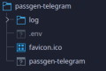
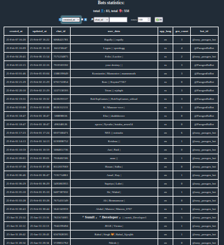
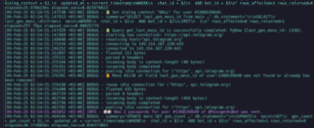

Readme на разных языках:
[EN](https://github.com/mammothcoding/passgen-telegram/blob/master/README.md)
[RU](https://github.com/mammothcoding/passgen-telegram/blob/master/README.ru.md)

# 📲 Passgen-telegram
Сервис телеграм-бота для генерации криптографически защищенных паролей/токенов и других наборов и последовательностей.

Имя развёрнутого бота: @easy_passgen_bot

Ссылка на бота: [@easy_passgen_bot](https://web.telegram.org/a/#7745281341)

Сервис способен обслуживать несколько ботов генераторов с соответствующими телеграм-токенами, именами и т.п.

### Telegram-bot
Работа с Telegram реализована с использованием библиотеки ["teloxide"](https://github.com/teloxide/teloxide).

Для каждого бота автоматически создаётся отдельный процесс, прослушивающий свой порт согласно основным настройкам конфигурации.

Основные настройки конфигурации сервиса должны находится в одном каталоге с файлом запуска сервиса в файле .env.

### Env
Работа с .env файлами реализована с использованием библиотеки ["env-file-reader"](https://github.com/jofas/env_file_reader).
Пример файла .env в каталоге ["examples"](./examples/) этого репозитория.
Если `TG_PROXY_ADDR` пуст, боты работают в прежнем режиме через webhook.
Если заданы `TG_PROXY_ADDR` и `TG_PROXY_PORT`, боты переключаются на long polling и используют указанный HTTP-прокси для запросов к Telegram Bot API.

### Passgen
Для генерирования паролей используется собственная библиотека ["passgen-lib"](https://github.com/mammothcoding/passgen-lib).

### DB
Для хранения условий генерирования паролей пользователей, контекстной информации для работы с ботами и информации для статистики используется библиотека ["sqlx"](https://github.com/launchbadge/sqlx).

Настроена работа с базами данных "Postgres".

### Statistics web-service

Для сбора и отображения статистики работы ботов реализован веб-сервис статистики с использованием библиотеки ["axum"](https://github.com/tokio-rs/axum).

Веб-сервис статистики запускается автоматически в отдельном процессе и доступен по ссылкам, предоставляемым в интерфейсе бота пользователям указанным в .env.
Настройки веб-сервиса так же делаются в .env.

### Log & stdout

Для обеспечения логирования и вывода информации о процессах работы сервисов используется библиотека ["log4rs"](https://github.com/estk/log4rs).
Конфигурирование логирования и вывода производиться в .env.

### ps:

Данный проект был создан так же и в целях изучения возможностей языка 🦀Rust. Поэтому некоторые решения в коде не являются оптимальными.

### License

[MIT](https://choosealicense.com/licenses/mit/)

### Другие проекты для генерации паролей
[passgen-lib](https://github.com/mammothcoding/passgen-lib)

[passgen-desktop](https://github.com/mammothcoding/passgen-desktop)

[passgen-console-linuxwin](https://github.com/mammothcoding/passgen-console-linuxwin)

[passgen-cmd](https://github.com/mammothcoding/passgen-cmd)
